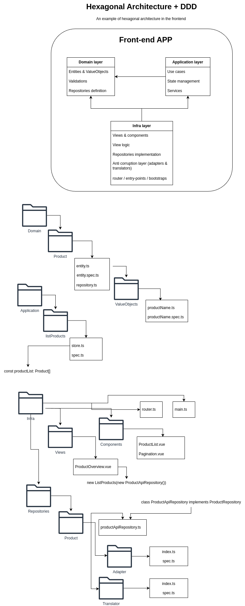

# Hexagonal Architecture + Domain-Driven Design (DDD) in Frontend

This repository provides an example of a frontend application structured using Hexagonal Architecture principles combined with Domain-Driven Design (DDD). It showcases a modular and maintainable approach to building scalable frontend projects.

## Overview

The project is organized into three main layers:

1. **Domain Layer**  
   Contains core business logic, including:

   - **Entities & Value Objects**: Define the main abstractions of the domain.
   - **Validations**: Ensure domain integrity.
   - **Repositories**: Define interfaces for data access.

2. **Application Layer**  
   Manages the application's use cases, state management, and services. This layer orchestrates interactions between the domain and infrastructure layers.

3. **Infrastructure Layer**  
   Implements the details of external systems such as:
   - Views and UI components.
   - Repository implementations.
   - Anti-corruption layers (adapters and translators).
   - Bootstrapping and routing.

## Folder Structure

The project proposes a simple and clean folder structure for easy navigation

## Key Concepts Demonstrated

- **Hexagonal Architecture**: Encapsulates business logic in the domain layer, ensuring it is independent of external systems.
- **Domain-Driven Design (DDD)**: Emphasizes the importance of the domain model and aligns code structure with business needs.
- **Testability**: Each layer is independently testable, with examples of unit tests provided for entities, value objects, and repositories.
- **Separation of Concerns**: Distinguishes responsibilities between domain, application, and infrastructure layers.
